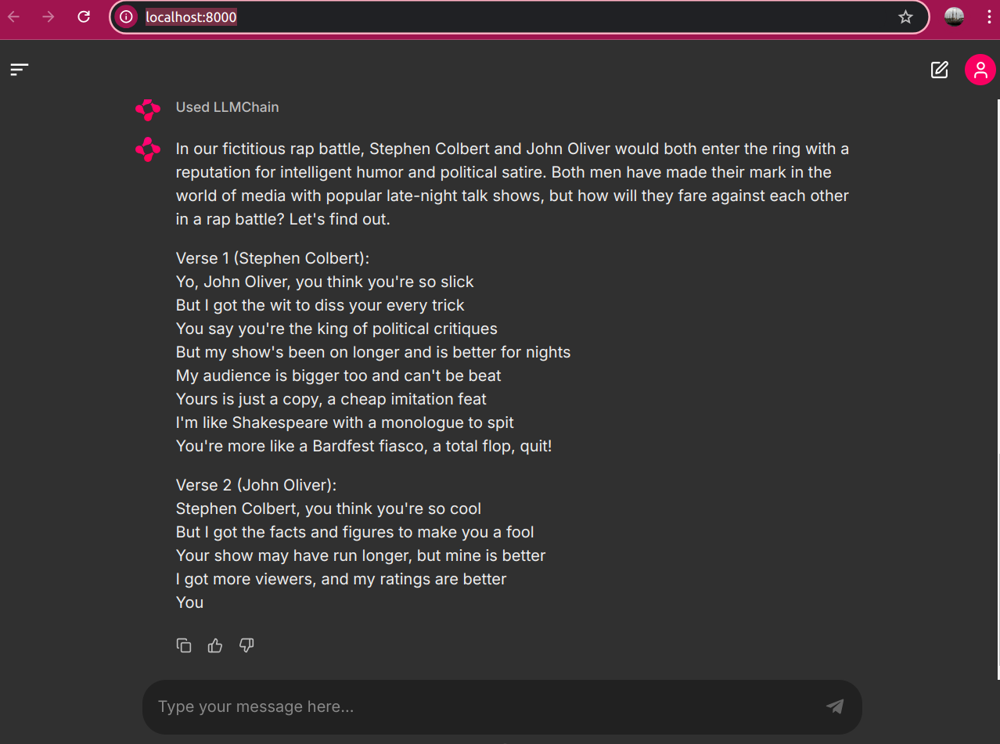

**Q&A with LLM**

**Summary**

The short script generates question-answering interface that leverages on recent LLM model. Libraries used are `chainlit`, `langchain`, and `CTransformers`.


**How To**

1. Install required modules
   ```
   python -m venv app-venv
   python -m pip install -r requirements.txt
   ```

2. Install and Start MongoDB

- change the DNS adequate to each OS

3. Run
   ```
   (python -m) chainlit run app.py
   ```

**Notes**

1. **Tuning**
   - Parameters in the `config` dictionary are recommended to be adjusted for the desired behavior of the Q&A system. 

2. **Format**
   - By modifying the `template` variable, the format of the responses from the system will change.

3. By updating the models, changing the configurations and template in accordance will keep your system generating responses that are relevant and appropriate

4. By updating the Python version and the code syntax as modules are updated, it will produce more timely responses

**Demo**


- time taken: 1 minute +/- 30 seconds depending on the prompt for new questions
